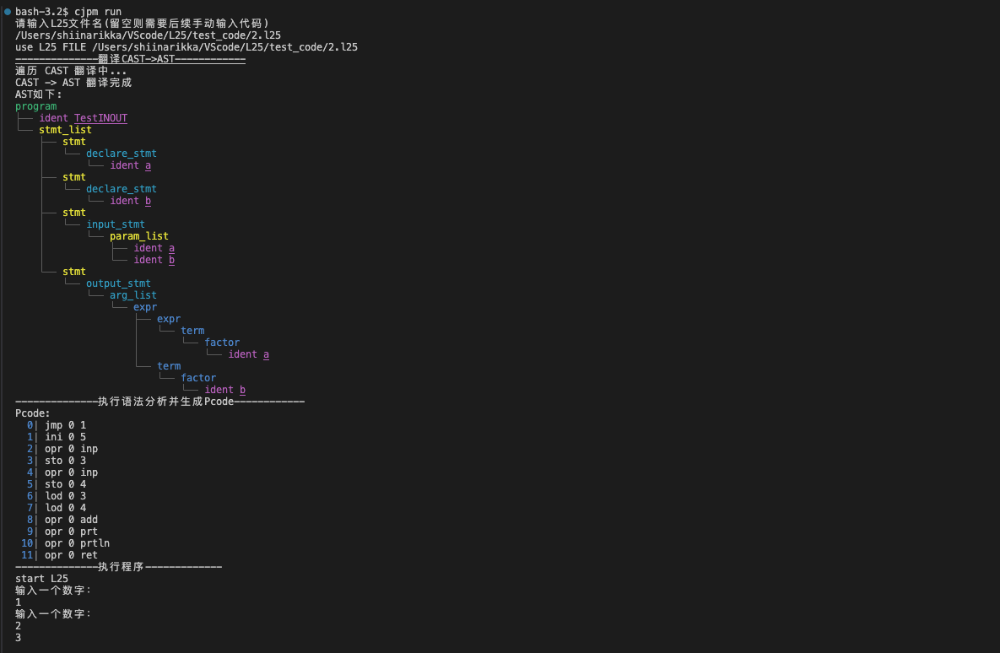
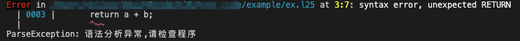
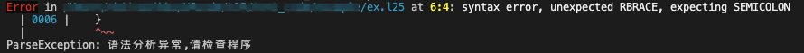

# L25-cangjie

> a compiler developed by **仓颉** for **L25 languages**


本编译器使用[flex](https://github.com/westes/flex)，[bison](https://www.gnu.org/savannah-checkouts/gnu/bison/bison.html)和[仓颉](#关于仓颉)实现[L25语言](#l25-语言)的编译执行，功能如下:

- 基于flex+bison实现基本词语法分析，并构建AST

- **加分：** 使用仓颉对AST进行语义分析，生成Pcode代码
  
- **加分：** 附加实现一个VScode代码高亮插件：[colorL25](https://marketplace.visualstudio.com/items?itemName=ShiinaRikka.colorl25&ssr=false#overview)
  
- 实现语法报错和简单错误处理

- 使用仓颉实现Pcode解释执行

# Quick Start 🤗
## 直接运行

⚠️ 当前预编译版本仅支持 **Apple Silicon (M1/M2/M3) 芯片的 macOS 设备**，其他架构需从源码构建

下载[release](https://github.com/lky1433223/L25-cangjie/releases)中的`L25-Compiler.zip`并解压。直接运行:```./main```。

运行时会显示编译过程中的AST和Pcode，最后执行L25程序。

示例：

<div style="display: flex; align-items: flex-start; gap: 20px;">

<div>

```swift
program TestINOUT{
    main{
        let a;
        let b;
        input(a,b);
        output(a+b);
    }
}
```

</div>

<div>

</div>

</div>

## 使用[colorL25](https://marketplace.visualstudio.com/items?itemName=ShiinaRikka.colorl25&ssr=false#overview)插件

1. 在VScode中，`Ctrl + Shift + P` (`Command + Shift + P`for mac) 打开命令面板
2. `View: Show Extensions`显示扩展
3. 在应用商店中搜索`colorL25`，安装扩展
4. 扩展会自动为`.l25`文件进行代码高亮显示
   
## 自己构建🔧
1. 配置仓颉
   - 安装[仓颉工具链](https://cangjie-lang.cn/docs?url=%2F0.53.18%2Fuser_manual%2Fsource_zh_cn%2Ffirst_understanding%2Finstall_Community.html)
   - 安装[CJPM](https://cangjie-lang.cn/docs?url=%2F0.53.18%2Fuser_manual%2Fsource_zh_cn%2FCompile-And-Build%2Fcjpm_usage_OHOS.html)
   - (可选) 安装[IDE插件](https://cangjie-lang.cn/docs?url=%2F0.53.18%2Ftools%2Fsource_zh_cn%2FIDE%2Fuser_manual_community.html)
2. 安装flex + bison
   
   本项目使用bison -v3.8.1,如果版本较低可能导致编译失败。需要构建新版本bison。

   参考bison[官方文档](https://www.gnu.org/savannah-checkouts/gnu/bison/bison.html):
   - 下载bison[源码](https://ftp.gnu.org/gnu/bison/bison-3.8.1.tar.gz)，并解压
   - 执行```configure```进行配置，需要选择路径： ```./configure --prefix=$HOME/mybison/installed```
   - 执行```make install```
   - 编译后的bison可执行文件在```$HOME/mybison/installed/bin```
   - 需要相应修改Makefile中的`YACC`

3. 构建项目
   ```bash
   make
   ```

4. 运行|调试|单元测试
   
   使用cjpm运行
   ```bash
   cjpm run
   ```
   测试
   ```bash
   cjpm run -g
   ```
   测试运行会额外显示一些调试信息：

   - 在翻译过程中显示每个ASTNode的信息。
   - 在编译过程中，每次新的定义都会打印当前符号表。
   - 在运行过程中，每个指令都打印指令地址，基址，和栈。
  
   单元测试，详细的单元测试内容请见[单元测试](#单元测试)
   ```bash
   cjpm test --parallel=true
   ```
⚠️warning: 遍历AST可能导致递归栈溢出，请开启编译优化：`-O2 --fno-chir-function-inlining`
## 代码行数统计
1. 安装[cloc](https://github.com/AlDanial/cloc)代码行数统计工具
2. 运行[```./cloc.sh```](cloc.sh)脚本，这会自动使用[```cangjie_lang.txt```](cangjie_lang.txt)配置文件，添加对**仓颉**和**L25语言**的代码行数统计

## 也许你会用到。。。。
[```./kill.sh```](kill.sh)，如果C代码中存在内存泄漏或空指针，仓颉在捕获时会发生异常，并导致程序无法自行停止。

你可能需要这个脚本来手动kill程序。


# L25 语言

## EBNF描述

```ENBF
<program> = "program" <ident> "{" { <func_def> } "main" "{" <stmt_list> "}" "}"

<func_def> = "func" <ident> "(" [ <param_list> ] ")" "{" <stmt_list> "return" <expr> ";" "}"

<param_list> = <ident> { "," <ident> }

<stmt_list> = <stmt> ";" { <stmt> ";" }

<stmt> = <declare_stmt> | <assign_stmt> | <if_stmt> | <while_stmt> | <input_stmt> |

<output_stmt> | <func_call>

<declare_stmt> = "let" <ident> [ "=" <expr> ]

<assign_stmt> = <ident> "=" <expr>

<if_stmt> = "if" "(" <bool_expr> ")" "{" <stmt_list> "}" [ "else" "{" <stmt_list> "}" ]

<while_stmt> = "while" "(" <bool_expr> ")" "{" <stmt_list> "}"

<func_call> = <ident> "(" [ <arg_list> ] ")"

<arg_list> = <expr> { "," <expr> }

<input_stmt> = "input" "(" <ident> { "," <ident> } ")"

<output_stmt> = "output" "(" <expr> { "," <expr> } ")"

<bool_expr> = <expr> ("==" | "!=" | "<" | "<=" | ">" | ">=") <expr>

<expr> = [ "+" | "-" ] <term> { ("+" | "-") <term> }

<term> = <factor> { ("*" | "/") <factor> }

<factor> = <ident> | <number> | "(" <expr> ")" | <func_call>

<ident> = <letter> { <letter> | <digit> }

<number> = <digit> { <digit> }

<letter> = "a" | "b" | ... | "z" | "A" | "B" | ... | "Z"

<digit> = "0" | "1" | ... | "9"
```

## 开发指南
### 初识L25
L25是为方便教学设计的，利于快速实现基本编译器功能的语言，能实现基本四则运算，布尔运算，函数定义，分支跳转，循环等语言基础功能。
### 运行第一个L25程序
首先，创建`1.l25`文件。并输入以下L25代码：
```swift
program AplusB{
   main{
      let a;
      let b;
      input(a, b);
      output(a + b);
   }
}
```
运行编译器，并输入文件路径[`path/to/your/1.l25`](test_code/example/1.l25)，你会看到输出的编译过程。随后输入两个数字，你会得到以下输出:
```
输入一个数字：
9
输入一个数字：
9
18 
```

### 变量声明
L25目前仅支持Int类型变量，所有Int类型默认为Int64类型。
支持声明时初始化或声明后再赋值。
```swift
program Example{
   main{
      let a;
      let b = 5;
      a = 1;
      output(a, b);
   }
}
```
- 允许在内层作用域声明变量，重名的变量会对外层作用域的变量进行覆盖。
```swift
program Example{
   main{
      let a = 1;
      if(1 == 1){
         let a = 4;
         output(a);
      };
      output(a);
   }
}
```
输出
```
4 
1
```
### 表达式
L25表达式支持四则运算和括号。可以用于赋值、布尔表达式和参数传递。
```swift
program Example{
   main{
      if(1 + 2 * 3 == 3 + 2 * 2){
         output(7);
      };
      output(1 + 2 * 2 + 3 * (4 + 5));
   }
}
```
输出
```
7
32
```
### 分支和循环
L25支持if-else表达式和while循环。
⚠️warning: if-else while语句结束时，需要添加`;`
```swift
program Example{
   main{
      if(1 + 1 == 2){
         output(2);
      }else{
         output(0);
      };
      let a = 1;
      while(a <= 5){
         output(a);
         a = a + 1;
      };
   }
}
```

### 函数定义和使用
L25可以在main函数之前定义函数，并且在程序中作为表达式的一项来使用。
函数中必须有最少一条语句，并且必须在函数末尾`return`

```swift
program Example{
   func add(a, b){
      let res = a + b;
      return res;
   }
   main{
      output(add(1,2));
   }
}
```


## 编译报错
本编译器基于Bison提供语法报错功能，以及一些语义报错功能。
### 语法报错
Bison可以对不符合语法的情况进行报错，下面是几个样例：
- 缺少语句
```swift
program AplusB{
   func add(a, b){
      return a + b;
   }
   main{
      output(add(1,2));
   }
}
```


- 缺少分号
```swift
program Example{
   main{
      if(1 == 2){
         let a = 1;
      }
   }
}
```


### 语义报错
在语义分析阶段，对几个常见错误进行了报错。该部分报错在[单元测试/编译器报错测试](#编译器报错测试)中有更详细的说明。

- 变量/函数重定义
- 变量/函数未定义
- 函数调用参数不匹配

# 单元测试
本项目使用仓颉提供的[单元测试](https://cangjie-lang.cn/docs?url=%2F0.53.18%2Flibs%2Fstd%2Funittest%2Funittest_package_overview.html)来实现对不同模块的测试验证。
[单元测试代码](/src/test/)|[L25测试用例](/test_code/)

## 解释器测试
解释器测试对[Pcode解释器](src/vm/interpret.cj)进行测试，保证虚拟机执行过程正确。[解释器测试代码](/src/test/interpret_test.cj)

测试包含：
- $+ - \times \div$ 基础运算测试
- $= \, \ne \, \ge \, \gt \, \le \, \lt$ 布尔运算测试
- `jmp`,  `jpc`跳转测试
- `DivisionByZero`异常测试

## 编译器测试
编译器测试使用[**编译测试代码**](src/test/compile_test.cj)对[**L25正确测试用例**](/test_code/correct_test/)进行测试。

确保**编译和运行正确**。

每个测试用例说明如下：

## 编译器报错测试
编译器测试使用[**编译错误测试代码**](src/test/compile_error.cj)对[**L25错误测试用例**](/test_code/error_test/)进行测试。

确保**正确汇报编译错误**。

每个测试用例说明如下：

## 完整功能验证
完整功能验证涉及输入输出和复杂功能，人工测试所有[复杂功能代码](test_code/complex_test)。
# 代码结构

# 关于仓颉 
 

[仓颉](https://cangjie-lang.cn/)是由华为技术有限公司开发的面向全场景应用开发的现代编程语言。

感谢[仓颉](https://cangjie-lang.cn/)的[跨语言互操作](https://cangjie-lang.cn/docs?url=%2F0.53.18%2Fuser_manual%2Fsource_zh_cn%2FFFI%2Fcangjie-c.html)能力，本项目才能基于 flex 和 bison 进行快速开发。

在本项目中，`C` 部分的代码会返回 `AST` 的根节点指针。在`仓颉`中由[CPointer<T>](https://docs.cangjie-lang.cn/docs/0.53.18/libs/std/core/core_package_api/core_package_intrinsics.html#cpointert)捕获该地址，并解析`AST`。

解析后的 `C` 风格的 `AST` 会被[翻译](src/translate.cj)为`仓颉`风格的`AST`，进行后续的语义分析和代码生成工作。


# Task List
## 待修复的bug

- 非叶子节点的line  colume绑定错误
  
## 待实现的功能

- 跨平台release（等待仓颉支持mac交叉编译）
  
## 待实现的语法

- used before init 报error
- 常量定义
- 实现多种变量类型
- 指针类型
- 实现函数嵌套声明
- 符号表中重命名变量的地址复用
  
## 语义语法分析及代码生成
| 非终结符 | C Sturct | Bison  | CAST  | AST  | CAST → AST  |  analyze | 备注 |
|------------------|--------|------------|-------------|------------|----------------|------------|------|
| program | ✅ | ✅ | ✅ | ✅ | ✅ | ✅ | - |
| func_def_list |✅ | ✅|✅ | ✅ | ✅ | ✅ | - |
| func_def | ✅ | ✅ | ✅ | ✅ |✅ | ✅ | - |
| param_list | ✅ | ✅ | ✅ | ✅| ✅| ✅| - |
| arg_list | ✅ | ✅ | ✅ | ✅ | ✅ | ✅ | - |
| stmt_list | ✅ | ✅ | ✅ | ✅ | ✅ | ✅ | - |
| stmt |  ✅  | ✅ | ✅ | ✅ | ✅ | ✅ | - |
| declare_stmt | ✅ | ✅ | ✅ | ✅ | ✅ | ✅ | - |
| assign_stmt | ✅ | ✅ | ✅ | ✅ | ✅ | ✅ | - |
| input_stmt | ✅ | ✅ | ✅ | ✅ | ✅ | ✅ | - |
| output_stmt | ✅ | ✅ | ✅ | ✅ | ✅ | ✅ | - |
| if_stmt | ✅ | ✅ | ✅ | ✅ | ✅ | ✅ | - |
| while_stmt | ✅ | ✅ | ✅ |✅ | ✅ | ✅ | - |
| func_call | ✅ | ✅ | ✅ | ✅ |✅ | ✅ | - |
| expr | ✅ | ✅  | ✅  | ✅  | ✅  | ✅  | - |
| term | ✅ | ✅  | ✅  | ✅  | ✅  | ✅  | - |
| factor | ✅ | ✅  | ✅  | ✅  | ✅  | ✅  | - |
| ident | ✅ | ✅ | ✅ | ✅ | ✅ | ✅ | - |
| number | ✅ | ✅ | ✅ | ✅ | ✅ | ✅ | - |
| bool_expr | ✅ | ✅ | ✅ | ✅ | ✅ | ✅ | - |