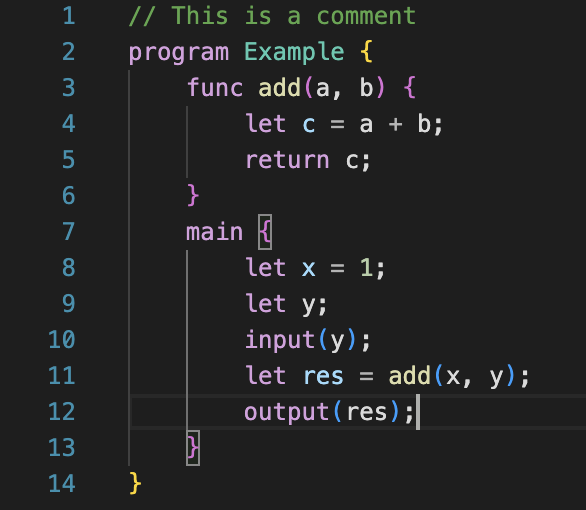

# L25 Syntax Highlighting

> A syntax highlighting extension for the **L25 programming language**.

## Features

- ✅ **Syntax highlighting** for `.l25` files  
- 🔤 Supports keywords (`if`, `while`, `func`, etc.)  
- 🔢 Highlights numeric literals and operators (`+`, `-`, `*`, `/`, etc.)  
- 📌 Highights type names (`program`) and function declarations  
- 💬 Supports single-line comments (`//`) and string literals  
- 🎨 function calls is highlighted with distinct scopes

### Example Syntax Highlighting

  

    
  

  

    <pre><code class="language-l25">
// This is a comment
program Example {
    func main() {
        let x = 42;
        let y;
        input(y);
        output(y);
    }
}
    </code></pre>
  

## Requirements

No special requirements. Just install the extension and open `.l25` files in VS Code.

## Extension Settings

This extension has no configurable settings.

## Known Issues

- Variable name highlighting may not work in complex expressions (e.g., `a + b`).
- Ensure your `.tmLanguage.json` file has valid regex patterns for full coverage.

## Release Notes

### 1.0.0
Initial release with support for:
- Keywords, comments, strings, numbers
- Operators and type declarations
- Function definitions and calls
- Variable declarations

---

## For Contributors

### Working with Markdown
You can edit this README using Visual Studio Code. Useful shortcuts:
- **Split editor**: `Cmd+\` (macOS) / `Ctrl+\` (Windows/Linux)
- **Toggle preview**: `Shift+Cmd+V` (macOS) / `Shift+Ctrl+V` (Windows/Linux)
- **Markdown snippets**: Press `Ctrl+Space` for suggestions

### For More Information
- [Visual Studio Code's Markdown Support](https://code.visualstudio.com/docs/languages/markdown)
- [Markdown Syntax Reference](https://help.github.com/articles/markdown-basics/)

---

**Enjoy!**  
This extension is designed to enhance your L25 development experience in VS Code. If you find bugs or want new features, feel free to open an issue or contribute to the project.

---